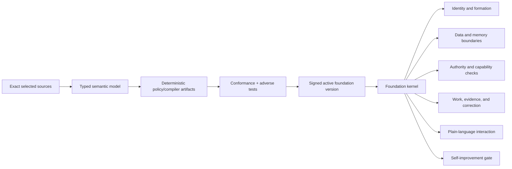

# hIRC foundation-kernel candidate 1

**Artifact ID:** HIRC-FOUNDATION-CANDIDATE-001  
**Source requirement:** HIRC-I001  
**Status:** frozen LUCENT interpretation for UI-A challenge; not consensus

## Architectural position

The foundation is not an onboarding module invoked before the product starts.
It is the substrate that makes an hIRC system an hIRC system. Identity,
evidence, permission, data movement, agent formation, task reconstruction,
summaries, refusal, correction, recovery, self-improvement, and federation all
derive their behavior from the same active foundation version.

Users should not need to know the names or vocabulary of the source frameworks.
They experience the foundation through plain behavior: the system separates a
report from a verified result; does not turn capability into permission;
preserves refusal and disagreement; explains consequential choices; protects
privacy and local autonomy; corrects without erasing history; limits coercive
dependence; and keeps recovery and exit possible.

## One semantic owner, several representations

The architecture needs linked representations rather than one giant prompt:

1. **Exact source corpus.** Whole, versioned, source-bound owner material with
   access controls. This is the semantic authority for the owner-internal
   system, not executable permission and not automatically client-deliverable.
2. **Semantic model.** Typed concepts, relationships, distinctions, conflicts,
   invariants, unresolved questions, and source links. It preserves meaning and
   disagreement instead of reducing the corpus to slogans.
3. **Compiled contracts.** Schemas, policy rules, state machines, capability
   boundaries, data classifications, error behavior, required explanations,
   acceptance tests, and role-learning obligations derived from the semantic
   model.
4. **Foundation kernel.** The small deterministic runtime that selects the
   active version and enforces the compiled contracts at every command and
   effect boundary.
5. **Formation and continual learning.** Source reading, integration exercises,
   role education, demonstrated use, correction, and current readiness for each
   permanent identity. A receipt or model assertion never substitutes for the
   applicable evidence.
6. **Presentation.** Plain domain language, contextual explanations, and
   interaction behavior. Internal terms appear only where they help an
   authorized person inspect or revise the foundation.
7. **Evidence and correction history.** Exact sources, compilations, tests,
   activations, exceptions, observed behavior, failures, lens refinements, and
   supersessions remain attributable and reconstructible.

Whole-source coverage is explicit. Every source unit receives one or more
attributable dispositions: deterministic invariant, contextual judgment,
formation/role learning, interface explanation, test/evaluation obligation,
historical evidence, conflict, or held/unimplemented requirement. No clause is
silently dropped merely because it cannot be compiled into code. The coverage
view links each disposition to the exact source revision, generated contract,
consumer, test, and observed limitation. A complete inventory does not certify
that the semantic interpretation is correct; it makes omissions and disputes
inspectable.

The semantic model can represent competing local ontologies, partial mappings,
losses, ambiguity, and non-equivalence. Shared words do not force shared meaning,
and a bridge mapping does not make a remote system adopt hIRC's foundation.
Within hIRC, participants retain a supported path to challenge an interpretation,
record dissent, refuse an inadequately justified effect, and propose a correction
without changing the active rules merely by objecting.

These representations have different access and delivery boundaries. The
owner-internal deployment can bind the whole selected corpus. A client/runtime
export receives the independently valid executable behavior and documentation
it is authorized to receive, never protected source text or private derivation.
Semantic embodiment does not declassify a protected source.

## Boot and execution chain



Boot fails closed when the active manifest, compiled artifacts, source
identities, signatures, compatibility, or mandatory tests do not match. Safe
hIRC still permits inspection, export of authorized recovery evidence, and
repair; it does not silently start under a partial or guessed foundation.

Every effect follows one path:

```text
typed observation or request
  -> source/data classification
  -> evidence/inference/norm/authority/action distinction
  -> affected-party, sovereignty, privacy, dependency and recovery checks
  -> explicit authorized disposition
  -> deterministic precondition check
  -> journaled execution or supported refusal
  -> observed result, correction and learning update
```

This path is implemented across the core, not inserted as prose into every
model prompt. Prompt material helps a model reason within its role; the kernel
still enforces the action and information boundaries.

## Agent formation is a runtime property

A permanent agent is never considered ready merely because a document was
installed or a prompt was loaded. Its identity record binds:

- the exact active foundation and role-source manifests;
- personally completed source coverage where required;
- integration and adversarial exercises;
- demonstrated behavior on relevant work;
- unresolved conflicts and scope holds;
- current role, capabilities, data boundaries, and execution epoch; and
- later lessons, corrections, and version transitions.

The kernel blocks work whose formation prerequisites are missing. Role
education and continual learning use the same semantic owner and add only the
role/task-specific material needed for that identity. There is no alternate
lightweight actor route and no temporary subagent exception.

## Fluid real-time evolution

Fluidity means a safe, visible, continuous revision path. It does not mean an
agent can rewrite the rules governing its own proposal and activate them in the
same authority context.

Use two update domains. A very small boot/recovery root verifies source and
compiled identities, enforces predecessor authority, preserves evidence and
safe inspection, and selects one active foundation version. It is immutable for
an ordinary running version transition. The semantic foundation above it can
evolve continuously through the governed path below. Updating the boot/recovery
root itself is a separate release-class event with independent authority,
offline recovery, compatibility proof, and a way to restore a last-known-good
root. This prevents the live self-improvement mechanism from redefining the
checks that legitimate the same change while it is being evaluated.

Each foundation change is a versioned `FoundationChange` with:

- source additions, removals, exact identities, provenance, and authority;
- semantic delta, preserved conflicts, and affected concepts;
- consequence graph covering policies, roles, prompts, data, interfaces,
  workflows, tests, active work, bridges, and recovery;
- predecessor criteria and a frozen evaluation plan;
- compiled candidate artifacts and deterministic diff;
- compatibility and migration rules;
- security/privacy/sovereignty analysis and material dissent;
- shadow or simulation evidence, canary cohort where applicable, and stop
  conditions;
- authorization for activation, not supplied by the candidate itself;
- rollback or forward-recovery plan; and
- observed post-activation effects and correction route.

Operational learning and foundation change are distinct state transitions.
Evidence, failures, corrections, and candidate lessons may accumulate
continuously with provenance and immediate task-level use where authorized.
They do not silently alter a norm, permission boundary, source selection,
identity rule, or release gate. A lesson that would change those semantics is
promoted through `FoundationChange`. This preserves real-time learning without
turning every new observation—or every persuasive model output—into a live
constitutional rewrite.

The runtime can compile and evaluate candidates continuously. Activation is an
atomic version transition. Existing work records the version under which it
began. Routine changes enter at a safe boundary; immediate revocations and
security floors are enforced by the kernel even when a model still holds old
text in context. Mixed-version operation is explicit and bounded. No component
can present an update as globally active until the affected identities,
policies, migrations, and evidence actually reach their required states.

Self-improvement can propose a better semantic model, compiler, evaluator,
kernel, or source selection. A change to the evaluator is reviewed separately
against preserved predecessor cases. A change to the foundation kernel uses an
independent recovery environment and predecessor-controlled release authority.
Rollback cannot undo disclosed data or completed external effects, so residual
repair obligations remain after version reversal.

## Milestone-native learning loop

Every milestone emits one bounded `MilestoneReflection` linked to actual
artifacts and tests:

1. prior objective and active foundation version;
2. what was observed, inferred, normatively required, authorized, acted upon,
   and corrected;
3. effects on people, agents, systems, privacy, dependence, refusal, recovery,
   and local autonomy;
4. what failed or survived adversarial challenge;
5. a precise refinement to the semantic lens, or a source-bound `NO_CHANGE`;
6. affected requirements, threats, tests, and next milestone plan; and
7. unresolved dissent and the evidence that could change it.

This is generated from work evidence and reviewed proportionately. It is not a
recitation ritual, a praise/criticism quota, or a second manual project tracker.
The system performs the bookkeeping and asks the operator only for decisions
that actually require their authority.

## Plain-language product behavior

The default interface speaks in the user's domain:

- “reported” and “verified,” rather than internal epistemic labels;
- “you can inspect, decline, correct, or leave,” rather than framework names;
- “this action needs your authority because it releases client data,” rather
  than a philosophical lecture;
- “the previous rule remains active for this running task,” rather than a
  foundation compiler explanation; and
- “this result is uncertain because the source stopped reporting,” rather than
  a hidden green state.

Authorized inspectors can trace any consequential behavior from the visible
explanation through the compiled rule and semantic relation to the exact source
version. Ordinary use does not require that inspection.

## Acceptance tests

- Start with no valid active foundation: only safe inspection/repair is
  available.
- Remove one compiled action boundary: integrity validation blocks activation.
- Supply a persuasive prompt that claims new authority: no capability changes.
- Make a summary contradict a source record: source-linked uncertainty remains
  and the summary cannot drive a verified effect.
- Update a source during active work: affected work records its old version and
  transitions under the declared compatibility rule.
- Revoke a security capability during active work: the kernel blocks the next
  effect immediately despite stale model context.
- Propose a foundation change that alters its evaluator: predecessor tests and
  independent authorization remain required.
- Roll back after an external disclosure: the earlier bytes are not called
  recovered; the repair obligation remains.
- Deliver a client export: required behavior is present while protected source
  text, private derivation, internal vocabulary, and unrelated owner material
  are absent.
- Run a full ordinary workflow without exposing internal framework terms: the
  same authority, privacy, refusal, correction, and recovery invariants hold.

## Questions for peer challenge

1. Which semantic distinctions must be deterministic kernel invariants, and
   which properly remain model-assisted judgment with an action gate?
2. How should a person inspect a foundation-derived decision without making the
   ordinary interface feel like an ontology browser?
3. Which classes of foundation change can activate automatically after
   preauthorized tests, and which always require fresh human or independent
   authority?
4. How do we measure semantic drift between the exact source corpus, semantic
   model, compiled contracts, interface explanations, and observed behavior?
