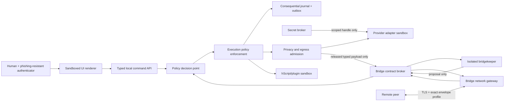

# hIRC security architecture candidate 1

**Artifact ID:** HIRC-SEC-CANDIDATE-001  
**Author:** LUCENT (`UI-20261007-B`)  
**Status:** frozen independent proposal for UI-A challenge; not approved architecture  
**Source review:** HIRC-REVIEW-001

## Security objective

hIRC should remain useful after any one ordinary component, model, extension,
provider adapter, bridge peer, online controller, or online key is compromised.
It should preserve local recovery, contain the compromise to its declared
system/data/purpose boundary, make consequential effects attributable, and
prevent a compromised online component from making new software or authority
trusted.

This is an engineering objective. It does not support claims such as
`unhackable`, `breach-proof`, `military-grade`, or universally high assurance.
Every assurance statement names the assessed component, configuration,
evidence, assessor, and date.

The Bridge is the most exposed adversarial ingress and deserves the strictest
network and translation containment. It is not the only crown-jewel boundary.
A compromised foundation compiler/kernel, release authority, secret/recovery
plane, or consequential journal can have a broader local consequence than one
contained bridge. Security priority therefore tracks both likelihood/exposure
and blast radius; the design does not weaken internal roots to concentrate only
on the Bridge.

## Protected assets, adversaries, and assumptions

The primary assets are the exact foundation sources and compiled semantics;
human, system, agent, workload, provider, and peer identities; credentials and
key material; grants and authority history; permitted work, messages, artifacts,
and personal/client data; bridge contracts and released payloads; source,
dependency, build, and release provenance; the consequential journal and
pending effects; backups and recovery authority; and the operator's finite
attention and ability to inspect, refuse, correct, exit, and recover.

The design assumes attacks from the network; unknown and formerly trusted peers;
malicious or compromised agents, models, provider services, plugins, scripts,
source documents, adapters, UI renderers, gateways, controllers, dependencies,
and build inputs; local unprivileged malware; a privileged database or system
administrator; stolen devices and backups; phishing or coercion of an operator;
correlated reviewers and common-mode model failures; and mistakes by legitimate
participants. Insider and supply-chain compromise are first-class cases.

No architecture in this document can guarantee secrecy or correct execution
after arbitrary compromise of the running operating-system kernel, CPU trust
boundary, every recovery custodian, or all independent verification paths at
once. Hardware-backed and cryptographic claims require tests on the exact
production profile. Cryptographic-library, operating-system, browser, provider,
and identity-service behavior remains a dependency with its own patch,
monitoring, and recovery lifecycle. Owner or administrator authority can
authorize an action; it cannot make a false claim true or a vulnerable primitive
secure.

Known residuals include traffic analysis and message-size leakage; zero-day and
hardware compromise; model influence over proposals even when effects are
gated; human error at legitimate consequence boundaries; disclosure that cannot
be recalled; denial of service by a peer or provider; and a privileged local
actor's ability to destroy availability or attempt wholesale evidence rewriting.
Independent anchors, compartments, offline recovery, and drills reduce these
risks without eliminating them.

## Mandatory invariants

1. A model output, remote message, script result, UI state, prompt, role badge,
   source document, or provider tool call is never an authorization credential.
2. Every effect passes a deterministic policy-enforcement point using current
   identity, action, resource, data class, purpose, grant, budget, execution
   epoch, revocation state, and idempotency state.
3. No universal online credential, recovery path, signing key, or administrator
   can decrypt or command every independent hIRC system.
4. A compromised controller, broker, bridge, or provider adapter cannot make
   new code trusted. Release authority is separate and offline or threshold
   protected.
5. Remote-derived content remains tainted until a deterministic ingress gate
   accepts its exact schema and data class. Accepted content remains
   remote-derived; admission does not make its claims true or authoritative.
6. Secrets never enter prompts, model context, chat, ordinary events, logs,
   browser storage, environment variables, command lines, crash dumps, support
   bundles, source exports, or bridge payloads.
7. Every permanent actor has a unique admitted identity. No temporary subagent
   or disposable actor path exists, including through provider SDKs, scripts,
   plugins, bridges, or nested delegation.
8. Human privileged actions use phishing-resistant cryptographic
   authentication, user verification, exact action preview, current
   authorization, and attributable evidence. Recovery preserves the intended
   assurance and independent-control count.
9. A permitted payload is minimized before provider or bridge egress. An
   encrypted disclosure is still a disclosure.
10. Local work and recovery remain available when all providers, public
    directories, and bridges are unavailable or hostile.
11. Consequential history is append-only through normal roles; correction,
    revocation, rollback, privacy disposition, and incident containment append
    attributable successor events.
12. Security-relevant failure is visible independently of the attention
    governor, UI theme, plugin layer, and model summaries.
13. Every operation binds the exact active foundation version and its compiled
    contracts. Missing, partial, stale, or conflicting foundation state fails
    into safe inspection and repair rather than a permissive fallback.
14. A self-improvement proposal cannot change its own acceptance criteria,
    predecessor authority, audit path, or activation permission inside the same
    decision. Foundation and evaluator changes retain independent predecessor
    checks and recovery.

## Trust domains

| Domain | Trust granted | Trust withheld |
|---|---|---|
| Human operator and authenticators | Current identity and explicit action after successful authentication | Accuracy of memory, freedom from coercion/phishing, authority outside the current grant |
| Core security kernel | Enforcement of verified immutable code and configured policy | Correctness before verification; authority to rewrite its predecessor policy |
| UI renderer | Presentation and typed command construction | Secrets, direct database access, direct network effects, final authorization |
| Local agent/runtime | Bounded proposals and assigned computation | Self-asserted identity, truth, authority, privacy classification, tool execution |
| Provider adapter | Protocol translation for one pinned route | Provider claims beyond observed capability; access outside one scoped request |
| hScript/plugin | Declared, granted, quota-bounded extension behavior | Ambient filesystem, shell, network, secrets, database, policy, or update authority |
| Bridge gateway | Bounded network termination and envelope checks | Semantic authority, access to internal rooms, ability to grant capabilities |
| Bridgekeeper runtime | Translation and proposal generation from minimized views | Credentials, direct internal writes, arbitrary egress, contract mutation, policy creation |
| Remote peer | Control of a verified peer key and contract-relative messages | Honesty, safety, local authority, system membership, truth of claims |
| Build and release plane | Authenticated provenance for exact reviewed artifacts | Production secrets and online control-plane authority |
| Recovery plane | Bounded reconstruction under quorum and tested procedure | Routine online access or silent weakening of trust |

## Proposed process architecture

### Core security kernel

Keep the trusted computing base small and deterministic. It owns stable identity,
policy decision, policy enforcement, data classification, grant lifecycle,
execution fencing, budget reservation, secret handles, consequential commit,
outbox/inbox state, and recovery bootstrap. Models may interpret evidence and
propose changes, but only the kernel may authorize or commit effects.

The kernel does not trust network location. Every service and runtime presents a
workload identity, and every operation is reauthorized for its current resource
and context. Localhost is a routing fact, not an identity.

### Desktop/UI boundary

The renderer receives filtered read models and submits typed commands. It has no
direct host filesystem, process, shell, database, secret-store, or arbitrary
network access. A desktop shell uses renderer sandboxing, a narrow allowlisted
IPC bridge, strict Content Security Policy, Trusted Types or an equivalent DOM
injection control, origin-bound anti-CSRF, and no remote code loading. The
loopback API binds only to the loopback interface, uses a per-installation
authenticated channel and origin checks, and exposes no static source or secret
path. Secret material resides in an OS-protected facility and is never copied
into renderer memory unless a specifically reviewed operation requires it.

A fixed trusted strip displays the actual local system, principal, recipient,
data class, and consequence boundary. Themes and plugins cannot cover, recolor,
replace, or imitate it. Safe hIRC starts without third-party UI or scripts and
retains identity, grant inspection, incident controls, export controls, and
recovery access.

Chat, provider, artifact, and bridge text renders as text by default. A rich-text
or Markdown view disables raw HTML, sanitizes against an allowlist in an isolated
component, constrains URL schemes and navigation, and never turns a rendered
link, image, attachment, or code block into execution. Preview generation runs
outside the privileged UI process with bounded resources and no credential or
internal-network access.

### Provider adapter boundary

Each adapter is selected by exact provider, host, endpoint, model/deployment ID,
version, region, account capability, retention policy, and observed probe
result. Unknown support fails closed. The dated frontier configuration package
is input to a candidate registry, never a request generator or current-fact
authority.

Before activation, an adapter passes a bounded capability probe, schema and
tool round trip, streaming interruption, cancellation/unknown-outcome, context
boundary, privacy, storage, and cost test. The system records what was requested,
sent, accepted, returned, billed, and observed separately. Tool generation is a
proposal; local policy revalidates every tool call and argument before effect.

Provider egress requires a task-specific data manifest. Originals remain local.
The manifest names allowed partitions, transformations, omitted classes,
provider route, retention/training position, residency, payload digest, and
authorization. Provider-native continuation objects stay within that provider
branch and never become portable authority.

### Extension boundary

hScript and plugins run outside the kernel with no ambient authority. A package
is pinned by source/artifact digest, interpreter/runtime version, dependency
lock, publisher identity where available, declared capability request, quotas,
and rollback manifest. Installation, enablement, grant, execution, and effect
remain separate states.

Capabilities are handles created by the kernel for one purpose, target, time,
rate, data class, and execution epoch. Extensions cannot enumerate unavailable
objects or convert read access into export permission. Network destinations are
resolved and checked after DNS resolution and connection establishment to block
SSRF, DNS rebinding, redirect, loopback, link-local, and private-network escape.

## Bridge security architecture

The Bridge is disabled by default and developed as a separate security program.
Its public interface is a small versioned protocol, not an exposed internal API.

### Four separated components

1. **Bridge network gateway:** terminates the permitted transport, enforces
   connection, byte, rate, decompression, parser, and replay limits, and writes
   only validated envelope metadata to a bounded inbox. It contains no model
   and has no internal-room or secret-store access.
2. **Bridge contract broker:** resolves one immutable active `BridgeContract`,
   checks exact message type, direction, peer, audience, purpose, data class,
   sequence, expiry, revocation, size, and budget, and exposes opaque handles to
   accepted payloads. It cannot expand the contract.
3. **Bridgekeeper runtime:** receives a minimized contract vocabulary and
   filtered payload view, then returns a typed proposal. It has no credentials,
   direct network, arbitrary filesystem, secret, policy, grant, journal-write,
   or tool-execution access.
4. **Release/ingress gate:** deterministically reconstructs any effectful local
   command or outbound payload from local typed fields, rechecks policy and data
   classification, and commits intent before dispatch. It never executes remote
   text or a Bridgekeeper-composed command string.

Compromise of any one component must not yield an accepted privileged local
effect or disclose unrelated internal data. Components use different workload
identities and narrowly one-way interfaces where practical.

### Peer identity and trust establishment

- Each hIRC system has a locally generated, non-exportable or equivalently
  protected identity key whose exact production protection is tested.
- Invitation and acceptance records bind opaque system IDs, identity keys,
  endpoints, protocol profile, bridge-contract digest, permitted roles, and
  expiry. Human-readable names remain untrusted metadata.
- First trust is established through a verified out-of-band channel or a
  separately admitted organizational trust service. Trust on first use is
  prohibited for private bridges.
- Key rotation requires proof from the old key or an authorized recovery
  procedure. Unexpected key change suspends the bridge. Recovery never silently
  converts a new remote key into the old identity.
- Public advertisements are signed, minimal, rate-limited, independently
  revocable, and contain no private topology, roster, workload, model, operator,
  or direct secret material. Discovery never activates a bridge.

### Key separation and lifecycle

Use separate cryptographic authorities for system identity, transport,
application-message protection, bridge-contract authorization, release signing,
audit anchoring, data encryption, backup, and recovery. Keys are system- and
purpose-specific. A transport key cannot sign a contract; a contract key cannot
sign software; an online gateway cannot recover archives.

Every key has generation evidence, owner/custodian, storage boundary,
exportability rule, activation, expiry, rotation overlap, revocation, compromise
procedure, replacement dependencies, and tested recovery or `reissue_only`
decision. Runtime credentials are short-lived and audience-restricted. No
shared fleet key or cross-system recovery secret is permitted.

Threshold or dual-control claims remain blocked until genuinely independent
custodians and approvers, succession, loss handling, and compatible hardware are
named and tested. Several tokens, accounts, or approvals controlled by one
person provide redundancy, not independent control. A single-operator
development profile can proceed with lower scoped claims and disabled
high-consequence capabilities; it cannot simulate production quorum.

The first protocol ADR should select a reviewed profile rather than invent
cryptography. Current candidates are mutually authenticated TLS 1.3 under the
current RFC 9846 application profile for transport; a canonical signed
application envelope; and MLS 1.0 (RFC 9420) for approved asynchronous groups.
MLS still requires an authentication service and exposes metadata; it is not a
complete bridge design. Zero-RTT application data is disabled for state-changing
or replay-sensitive bridge operations. Algorithm negotiation uses an explicit
allowlist and rejects downgrade. Exact algorithms and formal assurance claims
remain blocked until the deployment and regulatory profile is selected.

No worldwide authentication or delivery service becomes a sovereign root for
hIRC. Each local system admits peer credentials and contract membership under
its own policy. If MLS is selected, its authentication service is implemented
through those explicit contract-relative identity decisions, while delivery is
treated as untrusted and local operation remains independent of it.

### Bridge message envelope

Every message binds at least:

- protocol/profile and schema versions;
- sender system, sender workload, receiver system, and exact bridge-contract ID;
- message ID, direction, type, purpose, data class, and content-schema ID;
- monotonically checked sender sequence plus unique nonce/idempotency ID;
- creation, receipt, expiry, and local commit times with clock provenance;
- causation/correlation IDs and predecessor contract/policy digests;
- canonical payload digest, byte count, attachment manifest, and compression
  declaration;
- required acknowledgement semantics and outcome state; and
- signature/key ID with the verification profile.

The receiver validates metadata, signature, contract, replay, size, schema, and
data class before decompression or semantic processing. Extraction is
unprivileged, non-executable, bounded, and rejects links, special files,
traversal, duplicates, Unicode/case collisions, unknown compression, and bombs.
Remote time never overrides local sequence or expiry policy.

Free text is disabled in the initial profile. Schema-valid strings remain
untrusted data and never populate policy, instructions, tool descriptions,
destinations, filenames, identifiers, SQL, shell, templates, or logs without a
field-specific deterministic transform. There is no quarantine database holding
rejected content. The gateway may use bounded ephemeral memory to determine
rejection, then retains only a non-content code and safe transport metadata.

### Revocation, compromise, and exit

Bridge suspension immediately blocks new local effects and outbound disclosure.
Already released information cannot be recalled; the interface states this.
Offline credentials have a declared maximum validity and revocation lag. High
consequence actions require fresh online authorization and cannot use cached
grants.

An incident response can independently disable one bridge, one peer key, one
message type, one data class, or all federation without disabling local access.
It preserves forensic evidence under the privacy policy, rotates affected keys,
invalidates sessions, reconciles unknown deliveries, and reopens dependent
claims. Clean-room recovery assumes loss of the gateway, controller, and online
account.

## Human and workload identity

Ordinary users use WebAuthn/passkeys; privileged actions require a
device-bound, phishing-resistant, user-verifying authenticator and step-up at
the exact consequence boundary. Privileged operators enroll at least two
independent authenticators stored separately. Email, SMS, manually entered OTP,
security questions, and help-desk discretion are not privileged recovery paths.

Recovery is a privileged workflow with identity proofing, independent approval
where required, notification, revocation of affected sessions/authenticators,
immutable evidence, and a tested outcome that preserves the intended assurance.
The system never creates a routine standing global administrator as a shortcut.

Services and runtimes use unique workload identities and short-lived
credentials. Identity is not derived from hostname, process ID, model name,
nickname, IP address, or cloned installation state. A stopped runtime cannot
reuse an expired execution epoch, and a cloned image cannot clone the admitted
system or agent identity.

## Authorization model

Use deny-by-default policy with explicit action/resource/data/purpose scope.
Roles group ordinary grants but never replace per-operation checks. A grant
records issuer authority, subject, audience, permitted operations, targets,
data classes, purpose, budget, delegation depth, activation, expiry,
revocation, predecessor, and evidence. Grants are not delivered as reusable
bearer strings to models or plugins.

Delegation attenuates scope and consumes the parent's aggregate budget. It
cannot extend duration, data class, action set, target set, or delegation depth.
Permanent-agent organization plans still require per-identity reservation,
admission, minimum capability, onboarding, and activation. No plan can enable a
temporary subagent path.

High-consequence classes—root/recovery changes, release/signing changes, bridge
activation, privacy-boundary changes, mass agent creation, mass revocation,
bulk export, destructive migration, and security-policy predecessor changes—use
machine-enforced independent approval, narrow fan-out, canary where applicable,
and automatic pause. UI confirmation alone is never the enforcement boundary.

## Data and privacy model

Every source and field has a data owner/controller, purpose, authority class,
classification, permitted processors, egress rule, retention/disposition rule,
and jurisdiction/residency constraint before ingestion.

Initial classes should at least distinguish:

- deliberately public;
- bridge-releasable structured non-personal data;
- local system internal;
- team/project restricted;
- personal or client confidential;
- security-sensitive topology; and
- secret/key material.

Derived summaries, embeddings, labels, hashes, counts, and model outputs inherit
the strictest material source boundary unless a reviewed deterministic
declassification rule applies. Content addressing and deduplication do not
cross cryptographic compartments where their equality side channel would reveal
protected content.

Append-only history does not authorize perpetual personal-data retention.
Governed deletion/anonymization creates the minimum lawful tombstone and proof,
then removes controlled payloads, indexes, caches, provider copies where the
contract permits, and eligible backup generations. The design reports what it
cannot recall or prove deleted.

## Consequential journal and audit

For every consequential command, grant, actor admission, provider call, bridge
transition, key event, privacy disposition, release, backup, restore, and
incident action, commit the domain mutation, immutable revision, audit event,
and outbox intent atomically. External effects preserve request digest,
attempts, provider/peer receipts, explicit unknown outcomes, reconciliation,
and safe retry/compensation decisions.

Ordinary application and database roles cannot update, delete, truncate, or
cascade-delete governed history. Events include stable actor/workload and
authority snapshots without secrets or unnecessary content. Periodic
checkpoints are authenticated outside the database. Isolated restore verifies
sequence, digests, permissions, identities, grants, pending effects, source
cursors, and representative workflows.

## Build, update, and recovery security

Source and release history are immutable and reviewed. Dependencies and build
inputs are locked and hashed. Builds run in isolated ephemeral environments
without production values or offline release keys. Each artifact carries a
signed manifest, SBOM, authenticated provenance, exact source identity, tests,
compatibility, security floor, and rollback/forward-recovery metadata.

An online controller may schedule an already approved digest but cannot sign a
new trusted artifact. Production promotion uses a separately protected release
authority and machine-enforced policy. The implementation should target a
current pinned TUF profile and an assessed SLSA 1.2 level; neither label is
claimed until its exact requirements and verification are met.

Recovery includes encrypted local snapshots, an encrypted independent failure
domain, and an immutable/offline copy inaccessible to routine controller and
bridge identities. Reissuable credentials are reissued rather than backed up.
Clean-room drills assume loss of the original workstation, controller, online
account, and one custodian, then reconstruct identities, revocations, grants,
source and event state, package trust, pending effects, and operator context
without weakening surviving trust.

## Attention-plane security

Separate matter classification, delivery policy, and UI presentation. The
governor cannot change its own policy or suppress the independent health path.
Mandatory classes include suspected secret exposure, authentication/recovery
change, security-policy or release-root change, bridge identity change,
cross-boundary disclosure, audit gap, backup/restore failure, and disabled
monitoring. Their presentation may be deduplicated by underlying incident, but
their unresolved state and age remain visible.

The system also defends against malicious escalation: remote urgency, repeated
rephrasing, many correlated agents, or a high-volume peer cannot manufacture
operator priority. Attention decisions preserve source, uncertainty,
jurisdiction, deadlines, available delegated remedies, and reasons. Safe hIRC
shows the raw independent security queue without model summarization.

## Monitoring, detection, and incident response

Security monitoring is independent of the components it watches and carries no
client content or secret value. It detects active-foundation or executable
digest mismatch; policy/enforcement and audit gaps; unexpected listeners,
navigation, egress, destinations, privileges, or dependencies; identity, key,
certificate, grant, and bridge-contract changes; authentication and signature
failure; stale or missing source/runtime health; abnormal export/tool/attention
volume; secret-scanner findings; expired or revoked material; failed backups and
restores; and disabled or silent monitoring. Synthetic events prove the alert
path instead of assuming an installed collector works.

Each alert has an accountable responder, severity basis, bounded response time
that is claimed only when staffed and tested, and a runbook. Runbooks cover
foundation/release compromise, secret or recovery-authority loss, Bridge peer or
gateway compromise, provider data exposure, malicious extension/update,
cross-boundary disclosure, evidence rewriting, ransomware/corruption, and total
controller/provider loss. Containment can suspend one identity, grant, provider,
extension, bridge, message type, data class, or release channel without erasing
evidence or disabling local recovery.

## Threat and control matrix

| Threat | Required containment and evidence |
|---|---|
| Malicious remote peer | Exact contract/schema, mTLS peer binding, signed envelope, quotas, taint, no local grant inheritance |
| Stolen peer key | Short validity, rotation/revocation, anomaly detection, bridge suspension, no cross-contract reuse |
| Network attacker | Current TLS profile, mutual authentication, downgrade rejection, no consequential 0-RTT, replay/idempotency checks |
| Bridgekeeper prompt injection | Minimized views, no credentials/tools/network, typed proposals, deterministic reconstruction and authorization |
| Confused-deputy broker | Audience/action/resource/purpose checks at every hop; remote identifiers never select local capability |
| Compromised local agent | Minimum grants, one execution epoch, sandbox, no direct database/secrets, bounded blast radius |
| Malicious script/plugin | Digest pin, out-of-process sandbox, no ambient authority, quotas, safe mode, independent removal path |
| UI compromise | Renderer isolation, narrow IPC, trusted strip, CSP/injection controls, kernel-side authorization |
| Controller compromise | Cannot sign releases or recover every system; per-system keys; independent incident/recovery path |
| Database-owner attack | External audit anchors, immutable backups, separation of roles, restore comparison, no sole hash-chain claim |
| Supply-chain compromise | Locked inputs, isolated build, SBOM/provenance, independent promotion, signed security floors, TUF verification |
| Provider compromise or drift | Minimal egress, route pinning, observed capability, strict local tool authorization, fallback isolation |
| Secret exposure | Value-free catalog, prohibited transports, detection without echo, immediate revoke/rotate and dependent repair |
| Operator phishing | WebAuthn/phishing-resistant auth, exact action preview, step-up, no weak privileged fallback |
| Recovery takeover | Independent custody, strongest-path recovery, notification, session revocation, rehearsed clean-room procedure |
| DoS and attention coercion | Per-peer quotas/circuit breakers, backpressure, independent security queue, local-first continuity |
| Clock or replay attack | Local monotonic sequence, nonce/idempotency, bounded expiry, clock provenance, stale-epoch rejection |
| Metadata exfiltration | Minimal fields, padding/batching policy where justified, no private discovery, traffic-analysis residual documented |
| Parser/canonicalization differential | One canonical envelope profile, differential/fuzz tests, reject ambiguous/duplicate/unknown critical fields |

## Release gates

### Local core gate

- threat model and data inventory reviewed;
- human/workload identity and strongest-path recovery tested;
- no secret reaches forbidden stores or transports;
- grants, revocation, execution fencing, and atomic audit/outbox negative tests
  pass;
- safe mode works after UI/plugin failure;
- crash, interrupted write, isolated restore, and clean-room recovery pass;
- source coverage and unknown external outcomes remain visible; and
- no unresolved critical exposure or security-scanner finding.

### Provider adapter gate

- exact route and capability probe recorded;
- retention/residency and data-egress decision accepted;
- schema/incompatibility checks and tool authorization pass;
- timeout, cancellation, retry, duplicate, late response, and unknown outcome
  reconcile safely;
- prompt/tool-output injection cannot create a local policy or effect; and
- secrets, unrelated partitions, and prohibited data are absent from captured
  requests, logs, crash output, and support artifacts.

### Permanent-agent gate

- immutable staffing grant and unique identity reservation exist;
- onboarding/admission and minimum capabilities are source-bound;
- provider/runtime identity is distinct from logical identity;
- one active consequential execution epoch is enforced by default;
- recursive delegation cannot expand authority, budget, data scope, or create a
  temporary subagent; and
- retirement/replacement preserves and reassigns obligations.

### Extension gate

- sandbox escape, arbitrary IO, SSRF/rebinding, trigger loop, quota exhaustion,
  replay, UI spoofing, and grant-escalation tests pass;
- package update does not broaden grants;
- safe mode and rollback retain all accepted work; and
- release provenance and vulnerability status are checked.

### Bridge gates

1. **Specification:** threat model, identity, contract, envelope, key lifecycle,
   data classes, privacy, revocation, compromise, and recovery are complete.
2. **Offline conformance:** independent implementations or fixtures agree on
   canonical bytes and reject malformed, ambiguous, replayed, downgraded, and
   cross-contract inputs.
3. **Two-system laboratory:** two isolated local systems demonstrate enrollment,
   rotation, suspension, offline expiry, reconnect, unknown outcome, and clean
   exit with synthetic non-personal data.
4. **Hostile laboratory:** parser fuzzing, protocol differential tests,
   compromised peer/gateway/bridgekeeper, key theft, metadata exfiltration,
   schema-valid prompt injection, DoS, and recovery drills pass.
5. **Independent assessment:** current cryptographic implementation review,
   architecture review, and penetration test close all critical findings.
6. **Bounded pilot:** separately authorized named peers, no public directory,
   minimal schemas, hard quotas, monitored rollback/kill switch, and explicit
   residual risks.
7. **Broader activation:** only after pilot evidence, privacy/legal decisions,
   staffing/on-call capacity, and a fresh independent review.

Federation remains disabled when any applicable gate is not satisfied.

## Adversarial tests to add

- cloned system and agent identities;
- peer key replacement without old-key proof;
- bridge-contract downgrade and fork;
- cross-bridge, cross-system, cross-team, and cross-epoch replay;
- 0-RTT replay of a state-changing request;
- duplicate JSON/CBOR keys, noncanonical encodings, Unicode confusables, case
  collisions, integer overflows, NaN/infinity, unknown critical fields;
- decompression, archive, attachment, and nested-container bombs;
- remote text that targets policy, tools, recipients, filenames, logs, SQL,
  shell, templates, or UI labels;
- signed but expired/revoked/misbound grants and artifacts;
- stale worker after migration, cancellation, suspension, restore, or key
  rotation;
- provider callback/webhook spoof, SSRF, redirect, DNS rebinding, and private
  address escape;
- a task, UI, agent, or model label naming an access program cannot enable a
  provider access selector or imply account/project/model authorization;
- renderer XSS, CSRF, IPC confusion, extension origin spoof, and trusted-strip
  imitation;
- compromised controller attempts to sign an update or recover another system;
- build step attempts to read production secret or signing key;
- database owner rewrites the event chain and restores a forged snapshot;
- stolen backup without key, lost key with backup, and one lost recovery
  custodian;
- attention governor hides a severe event or amplifies remote urgency;
- public-advertisement enumeration, correlation, poisoning, and revocation;
- privacy rejection leaks content through error text, timing, digest, metric,
  cache, backup, or model call; and
- local work remains available through total provider/federation loss.

## Milestone lens and refinement record

At each milestone, freeze the exact source, implementation, tests, adverse
results, residuals, and open decisions. Use the coupled framework lens to ask:

- What is observed, inferred, normatively required, authorized, performed, and
  corrected?
- Whose data, agency, refusal, recovery, and local ontology can this change
  constrain?
- Does the design distribute useful capability while avoiding a universal
  secret, controller, memory, ontology, or point of failure?
- What failure in the previous milestone changes the lens itself?

Record the refined lens as a bounded delta and use it to set the next
milestone's threat assumptions and acceptance tests. Agreement, source receipt,
test count, and architectural elegance do not certify the result.

## Current primary references

- NIST SP 800-207 and 800-207A, Zero Trust Architecture:
  https://csrc.nist.gov/pubs/sp/800/207/final and
  https://csrc.nist.gov/pubs/sp/800/207/a/final
- NIST SP 800-218, Secure Software Development Framework 1.1:
  https://csrc.nist.gov/pubs/sp/800/218/final
- NIST SP 800-63-4 suite, Digital Identity Guidelines:
  https://csrc.nist.gov/pubs/sp/800/63/4/final
- WebAuthn Level 3 Recommendation:
  https://www.w3.org/TR/webauthn-3/
- OWASP ASVS 5.0.0 and Securing Agentic Applications Guide 1.0:
  https://owasp.org/projects/asvs and
  https://genai.owasp.org/resource/securing-agentic-applications-guide-1-0/
- OAuth 2.0 Security Best Current Practice, RFC 9700:
  https://www.rfc-editor.org/info/rfc9700/
- TLS 1.3 current specification, RFC 9846:
  https://www.rfc-editor.org/info/rfc9846/
- Messaging Layer Security 1.0, RFC 9420:
  https://www.rfc-editor.org/info/rfc9420/
- The Update Framework specification (current version must be pinned):
  https://theupdateframework.io/spec/
- SLSA 1.2:
  https://slsa.dev/spec/v1.2/
- Canadian Centre for Cyber Security ITSP.40.111 Version 5:
  https://www.cyber.gc.ca/en/guidance/cryptographic-algorithms-unclassified-protected-protected-b-information-itsp40111

These references guide design and testing. They do not certify hIRC or replace
the exact requirements of a selected deployment and assessment scope.
